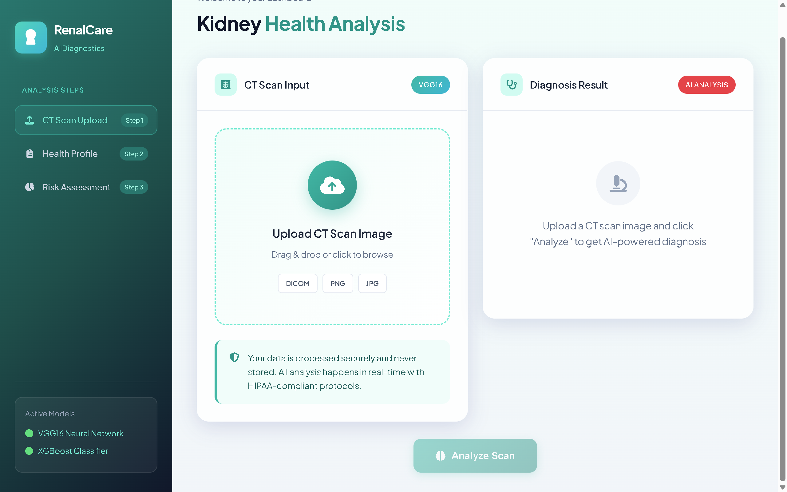
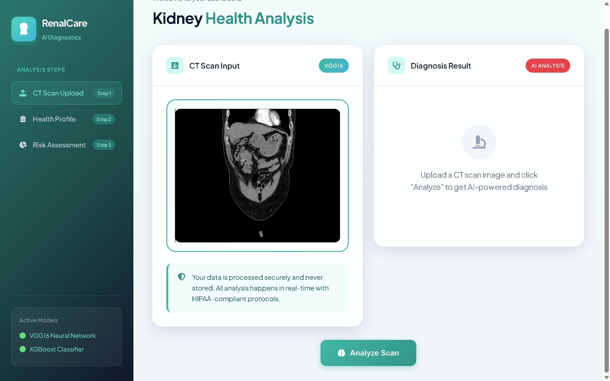
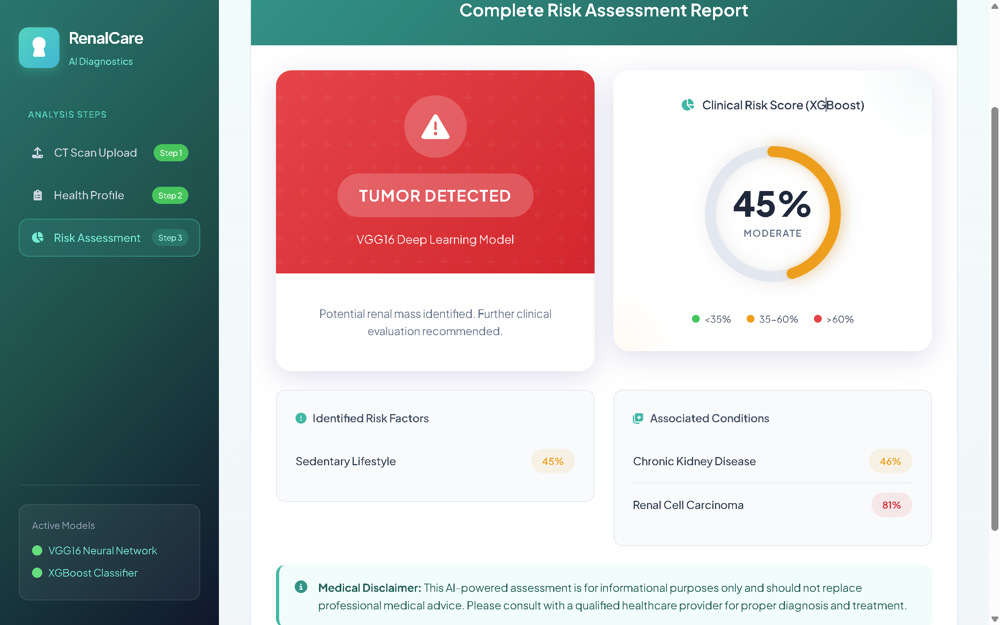

# 🏥 Renal Tumor Classification Project

<div align="center">


**AI-Powered Kidney Health Analysis System using Deep Learning**

[Features](#-features) • [Installation](#-installation-guide) • [Usage](#-usage) • [Screenshots](#-screenshots) • [Troubleshooting](#-troubleshooting-guide) • [Contributing](#-contributing)

</div>

---

## 📋 Table of Contents

- [Overview](#-overview)
- [Features](#-features)
- [Screenshots](#-screenshots)
- [System Requirements](#-system-requirements)
- [Installation Guide](#-installation-guide)
- [Usage](#-usage)
- [Project Structure](#-project-structure)
- [Workflows](#-workflows)
- [MLflow Integration](#-mlflow-integration)
- [DVC Pipeline](#-dvc-pipeline)
- [API Endpoints](#-api-endpoints)
- [Troubleshooting Guide](#-troubleshooting-guide)
- [Contributing](#-contributing)
- [License](#-license)

---

## 🔬 Overview

The **Renal Tumor Classification Project** is an advanced AI-powered diagnostic support system designed to assist healthcare professionals in detecting kidney tumors from CT scan images. Built using **VGG16 transfer learning** and integrated with a comprehensive **risk assessment module**, this system provides:

- 🎯 **Binary Classification**: Distinguishes between Normal and Tumor-affected kidney tissue
- 📊 **Risk Assessment**: Comprehensive health profile analysis based on symptoms and lifestyle factors
- 🏥 **Clinical Support**: Detailed diagnostic reports with associated condition probabilities
- 🔄 **MLOps Pipeline**: End-to-end reproducible machine learning workflow

---

## ✨ Features

### Core Features

| Feature                    | Description                                                 |
| -------------------------- | ----------------------------------------------------------- |
| 🖼️ **CT Scan Analysis**    | Upload kidney CT scan images for AI-powered tumor detection |
| 🧠 **Deep Learning Model** | VGG16 transfer learning with custom classification head     |
| 📋 **Health Profile**      | Comprehensive symptom and medical history assessment        |
| 📊 **Risk Assessment**     | ML-based risk inference for associated conditions           |
| 📈 **Detailed Reports**    | Exportable diagnosis reports with risk factors              |

### Technical Features

- ✅ Modular pipeline architecture
- ✅ MLflow experiment tracking
- ✅ DVC data versioning
- ✅ Flask REST API
- ✅ Responsive web interface
- ✅ Real-time predictions

---

## 📸 Screenshots

### Landing Page

The main dashboard providing access to all features of RenalCare AI.



### CT Scan Upload

Easy-to-use interface for uploading kidney CT scan images.



### Diagnosis Result

AI-powered analysis showing tumor detection results with confidence scores.


### Health Profile - Current Symptoms

Comprehensive symptom assessment for risk evaluation.


### Health Profile - Medical History & Lifestyle

Detailed medical history and lifestyle factor analysis.


### Risk Assessment Report

Complete risk assessment with associated conditions and recommendations.



---

## 💻 System Requirements

### Minimum Requirements

| Component   | Requirement                                    |
| ----------- | ---------------------------------------------- |
| **OS**      | Windows 10/11, macOS 10.15+, Ubuntu 18.04+     |
| **Python**  | 3.8 or higher                                  |
| **RAM**     | 8 GB minimum (16 GB recommended)               |
| **Storage** | 5 GB free space                                |
| **GPU**     | Optional (CUDA-compatible for faster training) |

### Software Dependencies

- Anaconda/Miniconda (recommended)
- Git
- Web browser (Chrome, Firefox, Edge)

---

## 📦 Installation Guide

### Method 1: Using Conda (Recommended)

#### Step 1: Clone the Repository

```bash
git clone https://github.com/Shyamanth-2005/renal_tumor_classification.git
cd renal_tumor_classification
```

#### Step 2: Create Conda Environment

```bash
# Create a new conda environment with Python 3.8
conda create -n renal python=3.8 -y
```

#### Step 3: Activate the Environment

**Windows (PowerShell):**

```powershell
# Run the conda hook and activate
(C:\Users\Shyam\anaconda3\shell\condabin\conda-hook.ps1) ; (conda activate renal)
```

**Windows (Command Prompt):**

```cmd
conda activate renal
```

**macOS/Linux:**

```bash
conda activate renal
```

#### Step 4: Install Dependencies

```bash
pip install -r requirements.txt
```

#### Step 5: Verify Installation

```bash
python -c "import tensorflow as tf; print(f'TensorFlow version: {tf.__version__}')"
python -c "from flask import Flask; print('Flask installed successfully')"
```

---

### Method 2: Using Virtual Environment (venv)

#### Step 1: Clone and Navigate

```bash
git clone https://github.com/Shyamanth-2005/renal_tumor_classification.git
cd renal_tumor_classification
```

#### Step 2: Create Virtual Environment

```bash
python -m venv venv
```

#### Step 3: Activate Virtual Environment

**Windows:**

```cmd
venv\Scripts\activate
```

**macOS/Linux:**

```bash
source venv/bin/activate
```

#### Step 4: Install Dependencies

```bash
pip install --upgrade pip
pip install -r requirements.txt
```

---

### Method 3: Docker Installation (Coming Soon)

```bash
# Pull the Docker image
docker pull shyamanth2005/renalcare-ai:latest

# Run the container
docker run -p 8085:8085 shyamanth2005/renalcare-ai:latest
```

---

## 🚀 Usage

### Running the Application

#### Quick Start

```bash
# Activate your environment first, then:
python app.py
```

The application will start at: **http://127.0.0.1:8085**

### Training the Model

#### Option 1: Run Complete Pipeline

```bash
python main.py
```

#### Option 2: Using DVC Pipeline

```bash
# Initialize DVC (first time only)
dvc init

# Reproduce the pipeline
dvc repro

# View pipeline DAG
dvc dag
```

#### Option 3: Via Web Interface

Navigate to `http://127.0.0.1:8085/train` or use the training endpoint.

---

## 📁 Project Structure

```
renal_tumor_classification_project/
├── 📄 app.py                    # Flask application entry point
├── 📄 main.py                   # Training pipeline executor
├── 📄 setup.py                  # Package setup configuration
├── 📄 requirements.txt          # Python dependencies
├── 📄 dvc.yaml                  # DVC pipeline configuration
├── 📄 params.yaml               # Model hyperparameters
├── 📄 scores.json               # Model evaluation scores
│
├── 📁 artifacts/                # Generated artifacts
│   ├── 📁 data_ingestion/       # Downloaded dataset
│   ├── 📁 prepare_base_model/   # Base model files
│   └── 📁 training/             # Trained model files
│
├── 📁 assets/                   # Documentation images
│   ├── 🖼️ landing_page.png
│   ├── 🖼️ upload.png
│   ├── 🖼️ diagnosis_result.png
│   └── 🖼️ ...
│
├── 📁 config/                   # Configuration files
│   └── 📄 config.yaml           # Main configuration
│
├── 📁 logs/                     # Application logs
│
├── 📁 research/                 # Jupyter notebooks
│   ├── 📓 01_data_ingestion.ipynb
│   ├── 📓 02_prepare_base_model.ipynb
│   ├── 📓 03_model_training.ipynb
│   └── 📓 04_model_evaluation_with_mlflow.ipynb
│
├── 📁 src/cnnClassifier/        # Source code
│   ├── 📁 components/           # Pipeline components
│   ├── 📁 config/               # Configuration manager
│   ├── 📁 entity/               # Data classes
│   ├── 📁 pipeline/             # Pipeline stages
│   └── 📁 utils/                # Utility functions
│
└── 📁 templates/                # HTML templates
    └── 📄 index.html            # Main web interface
```

---

## 🔄 Workflows

The development workflow follows these steps:

1. ✏️ Update `config.yaml`
2. 🔐 Update `secrets.yaml` (Optional)
3. ⚙️ Update `params.yaml`
4. 📦 Update the entity
5. 🔧 Update the configuration manager in `src/config`
6. 🧩 Update the components
7. 🔗 Update the pipeline
8. 🎯 Update `main.py`
9. 📊 Update `dvc.yaml`
10. 🚀 Update `app.py`

---

## 📊 MLflow Integration

### Local MLflow UI

```bash
mlflow ui
```

Access at: **http://127.0.0.1:5000**

### DagsHub Integration

Set environment variables for remote tracking:

**Windows (PowerShell):**

```powershell
$env:MLFLOW_TRACKING_URI = "https://dagshub.com/Shyamanth-2005/renal_tumor_classification.mlflow"
$env:MLFLOW_TRACKING_USERNAME = "Shyamanth-2005"
$env:MLFLOW_TRACKING_PASSWORD = "your_token_here"
```

**macOS/Linux:**

```bash
export MLFLOW_TRACKING_URI=https://dagshub.com/Shyamanth-2005/renal_tumor_classification.mlflow
export MLFLOW_TRACKING_USERNAME=Shyamanth-2005
export MLFLOW_TRACKING_PASSWORD=your_token_here
```

📖 [MLflow Documentation](https://mlflow.org/docs/latest/index.html)

---

## 🔗 DVC Pipeline

### Initialize DVC

```bash
dvc init
```

### Run Pipeline

```bash
dvc repro
```

### View Pipeline DAG

```bash
dvc dag
```

### Pipeline Stages

```
┌──────────────────┐
│  Data Ingestion  │
└────────┬─────────┘
         │
         ▼
┌──────────────────┐
│ Prepare Base     │
│     Model        │
└────────┬─────────┘
         │
         ▼
┌──────────────────┐
│  Model Training  │
└────────┬─────────┘
         │
         ▼
┌──────────────────┐
│ Model Evaluation │
└──────────────────┘
```

---

## 🔌 API Endpoints

| Endpoint        | Method   | Description              |
| --------------- | -------- | ------------------------ |
| `/`             | GET      | Main web interface       |
| `/predict`      | POST     | CT scan image prediction |
| `/analyze_risk` | POST     | Health risk assessment   |
| `/train`        | GET/POST | Trigger model training   |

### Example API Usage

#### Predict Endpoint

```python
import requests
import base64

# Read and encode image
with open("kidney_ct.jpg", "rb") as f:
    image_data = base64.b64encode(f.read()).decode()

# Make prediction request
response = requests.post(
    "http://127.0.0.1:8085/predict",
    json={"image": image_data}
)
print(response.json())
```

#### Risk Assessment Endpoint

```python
import requests

data = {
    "ct_result": "normal",
    "hematuria": 0,
    "flank_pain": 1,
    "hypertension": 1,
    "smoking": 2,
    "height": 175,
    "weight": 80
}

response = requests.post(
    "http://127.0.0.1:8085/analyze_risk",
    json=data
)
print(response.json())
```

---

## 🔧 Troubleshooting Guide

### Common Issues and Solutions

---

#### ❌ Issue 1: ModuleNotFoundError

**Error:**

```
ModuleNotFoundError: No module named 'cnnClassifier'
```

**Solution:**

```bash
# Install the package in development mode
pip install -e .

# Or add the src directory to PYTHONPATH
set PYTHONPATH=%PYTHONPATH%;%CD%\src  # Windows
export PYTHONPATH=$PYTHONPATH:$(pwd)/src  # Linux/macOS
```

---

#### ❌ Issue 2: TensorFlow/Keras Import Error

**Error:**

```
ImportError: cannot import name 'keras' from 'tensorflow'
```

**Solution:**

```bash
# Reinstall TensorFlow
pip uninstall tensorflow tensorflow-gpu keras
pip install tensorflow==2.12.0
```

---

#### ❌ Issue 3: CUDA/GPU Not Detected

**Error:**

```
Could not load dynamic library 'cudart64_110.dll'
```

**Solution:**

1. Install CUDA Toolkit 11.x from [NVIDIA CUDA](https://developer.nvidia.com/cuda-downloads)
2. Install cuDNN compatible with your CUDA version
3. Add CUDA bin directory to PATH

**Alternative (CPU-only):**

```bash
pip install tensorflow-cpu
```

---

#### ❌ Issue 4: Port Already in Use

**Error:**

```
OSError: [Errno 98] Address already in use
```

**Solution:**

**Windows:**

```powershell
# Find process using port 8085
netstat -ano | findstr :8085

# Kill the process (replace PID with actual process ID)
taskkill /PID <PID> /F
```

**Linux/macOS:**

```bash
# Find and kill process
lsof -i :8085
kill -9 <PID>
```

**Or change the port in `app.py`:**

```python
app.run(host="127.0.0.1", port=8086, debug=True)
```

---

#### ❌ Issue 5: Model File Not Found

**Error:**

```
FileNotFoundError: artifacts/training/model.h5 not found
```

**Solution:**

```bash
# Run the training pipeline first
python main.py

# Or use DVC to reproduce
dvc repro
```

---

#### ❌ Issue 6: Memory Error During Training

**Error:**

```
ResourceExhaustedError: OOM when allocating tensor
```

**Solution:**

1. **Reduce batch size** in `params.yaml`:

```yaml
BATCH_SIZE: 8 # Reduce from 16 or 32
```

2. **Enable memory growth** (add to training script):

```python
import tensorflow as tf
gpus = tf.config.experimental.list_physical_devices('GPU')
for gpu in gpus:
    tf.config.experimental.set_memory_growth(gpu, True)
```

3. **Use CPU if GPU memory is insufficient:**

```python
import os
os.environ['CUDA_VISIBLE_DEVICES'] = '-1'
```

---

#### ❌ Issue 7: DVC Pipeline Fails

**Error:**

```
DVC error: failed to reproduce 'data_ingestion'
```

**Solution:**

```bash
# Clear DVC cache
dvc gc -w

# Remove lock file
rm dvc.lock

# Retry
dvc repro
```

---

#### ❌ Issue 8: Flask CORS Error

**Error:**

```
Access to XMLHttpRequest has been blocked by CORS policy
```

**Solution:**
Ensure `flask-cors` is installed and properly configured:

```bash
pip install flask-cors
```

The app already includes CORS configuration:

```python
from flask_cors import CORS, cross_origin
CORS(app)
```

---

#### ❌ Issue 9: Conda Environment Not Activating

**Windows PowerShell Error:**

```
conda : The term 'conda' is not recognized
```

**Solution:**

```powershell
# Initialize conda for PowerShell
conda init powershell

# Restart PowerShell, then:
conda activate renal

# Or use the full path:
& C:\Users\Shyam\anaconda3\Scripts\activate.bat renal
```

---

#### ❌ Issue 10: Image Upload Fails

**Error:**

```
Error: Invalid image format
```

**Solution:**

- Ensure image is in JPEG or PNG format
- Check image size (should be reasonable, < 10MB)
- Verify base64 encoding is correct

```python
# Test image encoding
import base64
with open("test.jpg", "rb") as f:
    encoded = base64.b64encode(f.read()).decode('utf-8')
print(f"Encoded length: {len(encoded)}")
```

---

#### ❌ Issue 11: Risk Model Not Found Warning

**Error:**

```
Warning: Risk model not found
```

**Solution:**
The risk inference model is optional. To generate it:

```bash
# Run the risk model training notebook
jupyter notebook research/renal_tumor_other_dieseas_probabilites.ipynb
```

Or the application will use heuristic-based risk calculation as fallback.

---

#### ❌ Issue 12: pip Install Fails with SSL Error

**Error:**

```
SSL: CERTIFICATE_VERIFY_FAILED
```

**Solution:**

```bash
# Use trusted host option
pip install --trusted-host pypi.org --trusted-host files.pythonhosted.org -r requirements.txt

# Or update certificates
pip install --upgrade certifi
```

---

#### ❌ Issue 13: Pillow/Image Processing Errors

**Error:**

```
ImportError: cannot import name 'PILLOW_VERSION' from 'PIL'
```

**Solution:**

```bash
pip uninstall Pillow
pip install Pillow==9.5.0
```

---

#### ❌ Issue 14: joblib Load Error

**Error:**

```
ValueError: Cannot load file containing pickled data
```

**Solution:**
This usually means version mismatch. Retrain the model:

```bash
python main.py
```

Or ensure scikit-learn versions match:

```bash
pip install scikit-learn==1.2.2
```

---

### 📞 Getting Help

If you encounter issues not covered here:

1. 📝 Check the [Issues](https://github.com/Shyamanth-2005/renal_tumor_classification/issues) page
2. 🔍 Search existing issues for similar problems
3. 📮 Create a new issue with:
   - Error message (full traceback)
   - Steps to reproduce
   - System information (OS, Python version, etc.)
   - Screenshots if applicable

### Debug Mode

Enable debug logging by setting:

```python
import logging
logging.basicConfig(level=logging.DEBUG)
```

### Health Check

Run this script to verify your installation:

```python
# health_check.py
import sys
print(f"Python version: {sys.version}")

try:
    import tensorflow as tf
    print(f"✅ TensorFlow: {tf.__version__}")
except ImportError as e:
    print(f"❌ TensorFlow: {e}")

try:
    from flask import Flask
    print("✅ Flask: Installed")
except ImportError as e:
    print(f"❌ Flask: {e}")

try:
    import numpy as np
    print(f"✅ NumPy: {np.__version__}")
except ImportError as e:
    print(f"❌ NumPy: {e}")

try:
    import cv2
    print(f"✅ OpenCV: {cv2.__version__}")
except ImportError as e:
    print(f"❌ OpenCV: {e}")

print("\n✅ Health check complete!")
```

---

## 🤝 Contributing

Contributions are welcome! Please follow these steps:

1. Fork the repository
2. Create a feature branch (`git checkout -b feature/AmazingFeature`)
3. Commit your changes (`git commit -m 'Add some AmazingFeature'`)
4. Push to the branch (`git push origin feature/AmazingFeature`)
5. Open a Pull Request

### Development Setup

```bash
# Clone your fork
git clone https://github.com/YOUR_USERNAME/renal_tumor_classification.git
cd renal_tumor_classification

# Create development environment
conda create -n renal-dev python=3.8 -y
conda activate renal-dev

# Install dependencies with dev tools
pip install -r requirements.txt
pip install pytest black flake8

# Run tests
pytest tests/

# Format code
black src/
```

---

## 📄 License

This project is licensed under the MIT License - see the [LICENSE](LICENSE) file for details.

---

## 🙏 Acknowledgments

- VGG16 architecture by Visual Geometry Group, Oxford
- TensorFlow and Keras teams
- MLflow and DVC communities
- Medical imaging dataset providers
- Flask and Python communities

---

## 📚 References

- [VGG16 Paper](https://arxiv.org/abs/1409.1556)
- [Transfer Learning for Medical Imaging](https://arxiv.org/abs/1903.11101)
- [MLflow Documentation](https://mlflow.org/docs/latest/index.html)
- [DVC Documentation](https://dvc.org/doc)

---

<div align="center">

**Made with ❤️ by [Shyamanth](https://github.com/Shyamanth-2005)**

⭐ Star this repository if you found it helpful!

[Report Bug](https://github.com/Shyamanth-2005/renal_tumor_classification/issues) · [Request Feature](https://github.com/Shyamanth-2005/renal_tumor_classification/issues)

</div>
